# Diagrama de Classes — `rootine-api` (back-end)

Diagrama de classes atualizado do backend **NestJS + MikroORM + InversifyJS** do
Rootine, a partir do código real em `src/`. Substitui o diagrama conceitual
antigo (que misturava entidades de domínio com nomes de UML genéricos) por uma
visão fiel à implementação: **camada de IA** (`src/agents/`), **fachadas de
negócio** (services NestJS) e **entidades de domínio** (`src/entities/`).

> Complementa o [PADROES-GOF.md](./PADROES-GOF.md): aqui é a *estrutura*; lá é a
> *justificativa* de cada padrão (Strategy, Template Method, Chain of
> Responsibility, Facade).

---

## Diagrama

```mermaid
classDiagram
    direction TB

    %% =========================================================
    %% CAMADA DE IA (src/agents/)
    %% =========================================================
    class SpecialistAgent {
        <<interface>>
        +readonly key SpecialistKey
    }

    class OrchestratorAgent {
        -specialists: ReadonlyMap
        +processarIntencaoUsuario(input, context) Promise
        +delegarParaEspecialista(key) SpecialistAgent
        +asAgentRole(key) AgentRole
    }

    class GuardianAgent {
        +readonly key: "guardian"
        +selecionarMissoesDiarias(context) Promise
        +customizarDesafios(baseCandidate, context) Promise
    }

    class AdventurerAgent {
        +readonly key: "adventurer"
        +gerarQuizzesDinamicos(context) Promise
        +ajustarDificuldadeConteudo(context) Promise
    }

    class ScientistAgent {
        +readonly key: "scientist"
        +chat(message, context) Promise
    }

    class HabitatAgent {
        +readonly key: "habitat"
        +gerarEvolucaoHabitat(context) Promise
    }

    class AgentRunner {
        -providers: LlmProvider[]
        +runJsonAgent(opts) Promise
        +runAgentText(role, input) Promise
        -buildFallbackResult(role, fallback, error) T
    }

    class LlmProvider {
        <<interface>>
        +readonly name: string
        +isConfigured() boolean
        +complete(request) Promise
    }

    class OpenAiCompatibleProvider {
        <<abstract>>
        -apiKey: string
        -model: string
        -baseUrl: string
        +complete(request) Promise
        -request(apiKey, sys, user, jsonMode) Promise
        #shouldRetryWithoutJsonMode(status, text) boolean
    }

    class OpenAiProvider {
        +readonly name: "openai"
    }

    class GroqProvider {
        +readonly name: "groq"
        #shouldRetryWithoutJsonMode(status, text) boolean
    }

    %% =========================================================
    %% FACHADAS DE NEGÓCIO (services NestJS)
    %% =========================================================
    class OrchestratorService {
        +processarIntencaoUsuario(userId, input) Promise
        +criarCadastro(userId, nome) Promise
        +concluirMissao(userId, missionId) Promise
    }

    class UsersService {
        +getProfile(userId) Promise
        +ensureProfile(userId, nome) Promise
    }

    class MissionsService {
        +generate(userId, type, reqId) Promise
        +list(userId, status) Promise
        +edit(userId, id, feedback) Promise
        +complete(userId, missionId) Promise
        +refuse(userId, missionId) Promise
    }

    class QuizService {
        +generate(userId, amount) Promise
        +generateAdventure(userId) Promise
        +answer(input) Promise
    }

    

    

    class HabitatService {
        +getHabitat(userId) Promise
        +generateLeaves(userId) Promise
    }

    %% =========================================================
    %% ENTIDADES DE DOMÍNIO (MikroORM)
    %% =========================================================
    class Profile {
        +id: uuid
        +nome: string
        +xp: int
        +affinities: json
        +impactTotals: json
        +onboardingCompleted: bool
        +dailyFlashcardsCompleted: bool
    }

    

    

    class UserMission {
        +id: uuid
        +userId: uuid
        +title: string
        +description: string
        +status: MissionStatus
        +missionType: MissionTypeEnum
        +category: string
        +difficulty: int
        +xpReward: int
        +expectedImpact: json
        +patternKey: string
    }

    class MissionPattern {
        +key: string
        +category: string
        +environmentalGoal: string
        +difficultyMin/Max: int
        +impactModelKey: string
        +active: bool
        +isDisqualifiedBy(factKeys) boolean
        +affinityScore(affinities, factTypes) number
    }

    class Quiz {
        +id: uuid
        +userId: uuid
        +question: string
        +options: json
        +correctOption: string
        +category: string
        +createdAt: date
    }

    class QuizQuestion {
        +id: uuid
        +category: string
        +question: string
        +options: json
        +correctOption: string
        +difficulty: int
        +active: bool
    }

    class UserQuizAnswer {
        +id: uuid
        +userId: uuid
        +quizId: uuid
        +quizQuestionId: uuid
        +selectedOption: string
        +correct: bool
        +answeredAt: date
    }

    class Flashcard {
        +id: uuid
        +question: string
        +category: string
        +trueEffect: json
        +falseEffect: json
        +skipEffect: json
        +difficulty: int
        +active: bool
    }

    class UserFlashcardAnswer {
        +id: uuid
        +userId: uuid
        +flashcardId: uuid
        +dailyBatch: uuid
        +answer: bool
        +answeredAt: date
    }

    class UserDailyFlashcards {
        +id: uuid
        +userId: uuid
        +amount: int
        +completedAt: date
        +createdAt: date
    }

    class HabitatLeaf {
        +id: uuid
        +userId: uuid
        +position: int
        +title: string
        +message: string
        +createdAt: date
    }

    class XpLedger {
        +id: uuid
        +userId: uuid
        +sourceType: string
        +xpDelta: int
        +idempotencyKey: string
        +metadata: json
        +createdAt: date
    }

    class ImpactLedger {
        +id: uuid
        +userId: uuid
        +missionId: uuid
        +impact: json
        +impactModelKey: string
        +idempotencyKey: string
        +createdAt: date
    }

    class AchievementDefinition {
        +key: string
        +title: string
        +xpReward: int
        +criteria: json
        +active: bool
    }

    class UserAchievement {
        +id: uuid
        +userId: uuid
        +achievementKey: string
        +unlockedAt: date
    }

    %% =========================================================
    %% RELAÇÕES — Camada de IA
    %% =========================================================
    GuardianAgent ..|> SpecialistAgent
    AdventurerAgent ..|> SpecialistAgent
    ScientistAgent ..|> SpecialistAgent
    HabitatAgent ..|> SpecialistAgent

    OrchestratorAgent o-- "4" SpecialistAgent : registro\n(substitui switch)

    OrchestratorAgent --> AgentRunner
    GuardianAgent --> AgentRunner
    AdventurerAgent --> AgentRunner
    ScientistAgent --> AgentRunner
    HabitatAgent --> AgentRunner

    OpenAiCompatibleProvider ..|> LlmProvider
    OpenAiProvider --|> OpenAiCompatibleProvider
    GroqProvider --|> OpenAiCompatibleProvider

    AgentRunner o-- "*" LlmProvider : cascata\n(Chain of Responsibility)

    %% =========================================================
    %% RELAÇÕES — Fachadas → Agentes
    %% =========================================================
    OrchestratorService --> OrchestratorAgent
    MissionsService --> GuardianAgent
    QuizService --> AdventurerAgent
    HabitatService --> HabitatAgent

    %% =========================================================
    %% RELAÇÕES — Fachadas → Fachadas
    %% =========================================================
    OrchestratorService --> UsersService
    OrchestratorService --> MissionsService

    %% =========================================================
    %% RELAÇÕES — Fachadas → Entidades
    %% =========================================================
    UsersService --> Profile
    MissionsService --> UserMission
    MissionsService --> MissionPattern
    QuizService --> Quiz
    QuizService --> QuizQuestion
    QuizService --> UserQuizAnswer
    HabitatService --> HabitatLeaf

    %% =========================================================
    %% RELAÇÕES — Domínio (Entidades)
    %% =========================================================

    Profile "1" --> "*" UserMission : executa
    Profile "1" --> "*" Quiz : responde
    Profile "1" --> "*" HabitatLeaf : possui
    Profile "1" --> "*" XpLedger : acumula XP
    Profile "1" --> "*" ImpactLedger : gera impacto
    Profile "1" --> "*" UserAchievement : conquista

    Quiz --> QuizQuestion : snapshot de
    UserQuizAnswer --> Quiz : referencia
    UserQuizAnswer --> QuizQuestion : avalia

    UserFlashcardAnswer --> Flashcard : responde
    UserFlashcardAnswer --> UserDailyFlashcards : lote diário

    UserMission --> MissionPattern : padrão
    UserMission --> ImpactLedger : gera

    UserAchievement --> AchievementDefinition : chave

    %% =========================================================
    %% NOTAS DOS PADRÕES GOF
    %% =========================================================
    note for LlmProvider "Strategy: backends intercambiáveis"
    note for OpenAiCompatibleProvider "Template Method: transporte HTTP reutilizável"
    note for AgentRunner "Chain of Responsibility: cascata com fallback"
    note for OrchestratorService "Facade: esconde IA + domínio"
```

---

## Como ler o diagrama

O backend tem **três camadas** bem separadas, cada uma com uma
responsabilidade distinta.

### 1. Camada de IA (`src/agents/`)

A camada onde vivem os padrões GOF (detalhados no
[PADROES-GOF.md](./PADROES-GOF.md)):

- **`SpecialistAgent`** — contrato comum dos quatro especialistas
  (`readonly key`). É o que permite ao `OrchestratorAgent` guardá-los num
  registro `Map` e rotear por chave, em vez de um `switch` sobre classes
  concretas (OCP / Protected Variations).
- **`OrchestratorAgent`** — fachada da IA: classifica a intenção do usuário
  (`processarIntencaoUsuario`) e delega ao especialista certo
  (`delegarParaEspecialista`). Não persiste nada.
- **`GuardianAgent` / `AdventurerAgent` / `ScientistAgent` / `HabitatAgent`** —
  especialistas. Importante: a semântica segue o diagrama de produto —
  **Guardião = missões/desafios** e **Aventureiro = quizzes/conteúdo
  educativo** (invertido em relação ao código Deno legado; os *roles* nos logs
  são mantidos por compatibilidade — ver `src/agents/types.ts`).
- **`AgentRunner`** — recebe a lista ordenada de `LlmProvider` por injeção
  (`@multiInject`) e tenta cada provedor configurado em cascata
  (**Chain of Responsibility** / fallback).
- **`LlmProvider`** (interface) + **`OpenAiCompatibleProvider`** (abstrata) +
  **`OpenAiProvider`/`GroqProvider`** — **Strategy** (backends
  intercambiáveis) sobre um **Template Method** (todo o transporte HTTP vive
  na classe base; subclasses só descrevem `apiKey/model/baseUrl` e o hook
  `shouldRetryWithoutJsonMode`).

### 2. Fachadas de negócio (services NestJS)

Cada *service* é uma **Facade** que esconde a coreografia entre IA + domínio +
banco. Os controllers HTTP chamam apenas o método de intenção:

- `OrchestratorService` coordena `UsersService`, `MissionsService`,
- `MissionsService`→`GuardianAgent`, `QuizService`→`AdventurerAgent`,
  `HabitatService`→`HabitatAgent`, `ProfileService`→`ScientistAgent`. Em todos,
  **a IA só refina texto/variações**; a verdade do dado é determinística.

### 3. Entidades de domínio (`src/entities/`, MikroORM)

Mapeamento entre o diagrama conceitual antigo e as entidades reais:

| Conceito antigo      | Entidade(s) real(is)                                  |
|----------------------|-------------------------------------------------------|
| `User`               | `Profile`                                             |
|
| `Leaderboard`        | (derivado) `LeaderboardService`                       |
| `Missao`             | `UserMission` (+ catálogo `MissionPattern`)           |
| `Habitat`            | `HabitatLeaf` (nível/saúde derivados da curva de XP)  |
| `Quiz`               | `Quiz` (snapshot) + `QuizQuestion` (catálogo)         |
| `Flashcard`          | `Flashcard` (+ `UserFlashcardAnswer`, `UserDailyFlashcards`) |
| `ConteudoEducativo`  | **removido** — não existe superclasse no código       |

#### Sobre Quiz / QuizQuestion (correção em relação à 1ª versão)

`Quiz` e `QuizQuestion` **não são isolados**. O fluxo real é:

1. `QuizQuestion` é o **catálogo determinístico** (`active = true`).
2. `QuizService` seleciona uma pergunta e grava um **snapshot por usuário** em
   `Quiz` (`userId` → `Profile`; `Quiz ..> QuizQuestion`).
3. A resposta vira um `UserQuizAnswer` que referencia `userId`, `quizId` e
   `quizQuestionId`.

> ⚠️ Não há *foreign keys* formais entre essas tabelas — o MikroORM as relaciona
> por colunas `userId`/`*_id`. As setas tracejadas (`..>`) no diagrama
> representam essas **dependências lógicas**, não constraints do banco.

---

## Principais mudanças vs. diagrama antigo

- **Camada de IA explícita** com os padrões GOF (Strategy, Template Method,
  Chain of Responsibility, Facade) — ausente no diagrama conceitual.
- **Separação fachada-IA × fachada-negócio**: `OrchestratorAgent` (decide) vs.
  `OrchestratorService` (persiste).
- **Semântica Guardião/Aventureiro invertida** para casar com o produto.
- **Entidades reais do MikroORM** no lugar das classes conceituais.
- **`ConteudoEducativo` abstrato removido**: `Quiz`, `QuizQuestion` e `Flashcard`
  são entidades independentes (flashcards são catálogo determinístico, nunca
  gerados por IA).
- **Novos elementos de gamificação**: `XpLedger`, `ImpactLedger`,
  `AchievementDefinition`/`UserAchievement`, `LeaderboardService`.
- **Quiz/QuizQuestion reconectados** (corrigido): snapshot por usuário +
  catálogo + respostas.
